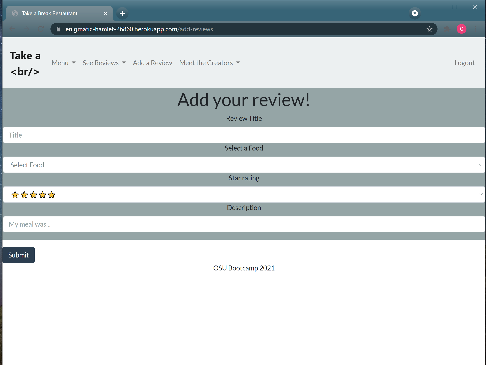

  

# Take-a-Break
 
## Table of Contents 
[Description](#description)  
[Installation](#installation)
[Process](#process)  
[Usage/Link](#usage/link)  
[Collaborators](#collaborators)

 
## Description
This is a website for Take a Break restaurant where users can browse the menu, read reviews, and leave reviews. By logging in users are granted access to write reviews for menu items and guests viewing the site can see these reviews. 

## User Story  ##
As a user, I want to browse the menu when I visit the restaurant website, read reviews other users have left, and leave reviews.

## Features ## 
This application has the following features:

1.
2.
3.
4.
5.
## Directions for Future Development ##
Create a way to place orders
Differentiate food critics and regular users
Allow reviewers to upload pictures
Allow for star rating to be included in reviews

## Motivations for Development ##
We visited several restaurant websites online and noticed that users had to navigate to multiple screens to add reviews and see reviews created by people who had ordered food from these websites. We wanted to create a website from scratch that had a polished UI, was responsive, and accepted and responded to user input. 

## Challenges ##
Coming up with what we wanted to do: at first, we decided to work on restaurants in Columbus but we found out later that the task was too vague to accomplish so we decided to stick with one restaurant
Our application broke down in the last minute application so we had to spend extra time fixing it

## Successes ##
Once we agreed on one restaurant, everything went smoothly
We successfully completed all tasks on time even with one developer short
We didn't have too many merge conflicts

## Installation
Clone Repository
git clone  https://enigmatic-hamlet-26860.herokuapp.com/
 Install Dependencies
All NPM packages required for this application (Express, Sequelize, Bootstrap, ScrollReveal) are already listed as dependencies in the package.json file. Run the command 'npm i' command in your terminal at the root directory level to install the packages.
Ensure you have Node.js installed on your machine. The application will be invoked by entering node server.js in the command line.
Start Application
You will see App running on port 3000! in the console. You can then view the app on http://localhost:3000/.

This program can be run through a browser using the above link to the the deployed application. Alternatively, to run this application locally you will need to:
Clone this repository to receive all of the files
Set up your environment variables in a .env file
Run "npm install" in the command line of your terminal to set up all of the dependencies
Initialize your database by running the "schema.sql" file with MySQL
Populate the existing database items by running "npm run seed" in your terminal
Run "npm start" to start the application's connection
Go to the url of the application (http//:localhost:3001) to begin using it

## Process

## Technologies Used ##
Node.js and Express.js- creating a RESTful API,
MySQL and Sequelize ORM- database,
Handlebars.js- template engine,
Bootstrap- CSS framework,
ScrollReveal- JS library

## Task Breakdown ##
Task breakdown:
Database/Routing- Christian Tanicala
Back-End- Basu Khanal
Front-End- Cameron White

## Usage

*You can access the deployed application here: https://enigmatic-hamlet-26860.herokuapp.com/.  

*After navigating to the application through the link, users open to a welcome page with a responsive nav bar.
  

*Navigate to the login button to login or sign up. This gives users access to adding reviews to any of the foods on the menu.
  
*  

*Without logging in users are able to browse the menu.

## Licensing
Licensed under [MIT license](LICENSE).

## Collaborators

**Main Branch**

Database: Christian Tanicala - [GitHub Profile](https://github.com/Chtanicala)

**Additional Branches**

Back-end: Basu Khanal - [GitHub Profile](https://https://github.com/bkhanal87)

Cameron White: Front-end - [GitHub Profile](https://github.com/CamJade)

